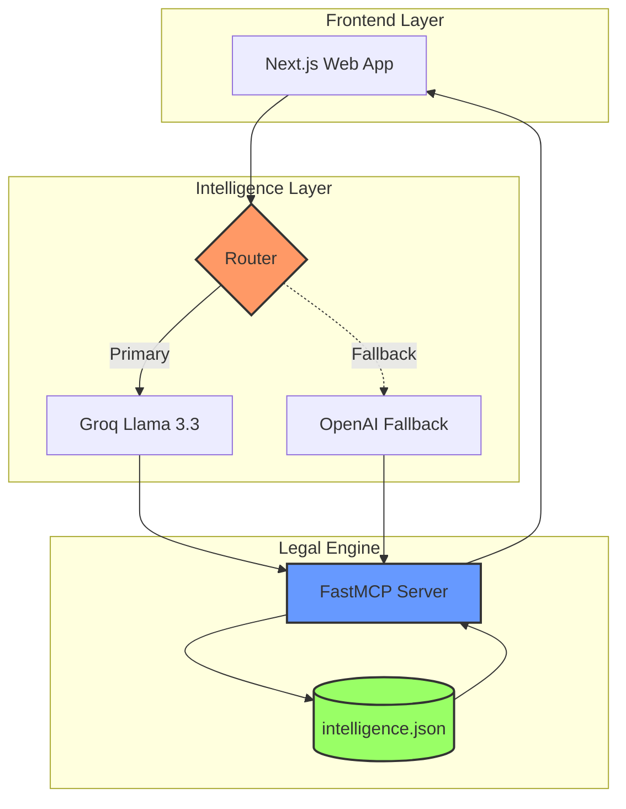

# Welcome to LawyerBot

## Project info

URL: https://legal-insight-engine-main.vercel.app

This project is built with:

- Vite
- TypeScript
- React
- shadcn-ui
- Tailwind CSS

Req ID,Business Requirement,Technical Implementation,Validation Method
FR-01,Rapid Legal Data Retrieval,FastMCP Server with indexed intelligence.json,Tool-call latency < 200ms
FR-02,High-Inference Reasoning,Groq Llama 3.3 (LPU Inference),Semantic accuracy check
NFR-01,System Resilience,Multi-Model Fallback (OpenAI GPT-5.3),429 Error Trigger Test
NFR-02,Observability,Real-time Health Monitor Component,Dashboard status heartbeat
NFR-03,Cost Efficiency,Context Pruning & Token Budgeting,API usage log analysis
