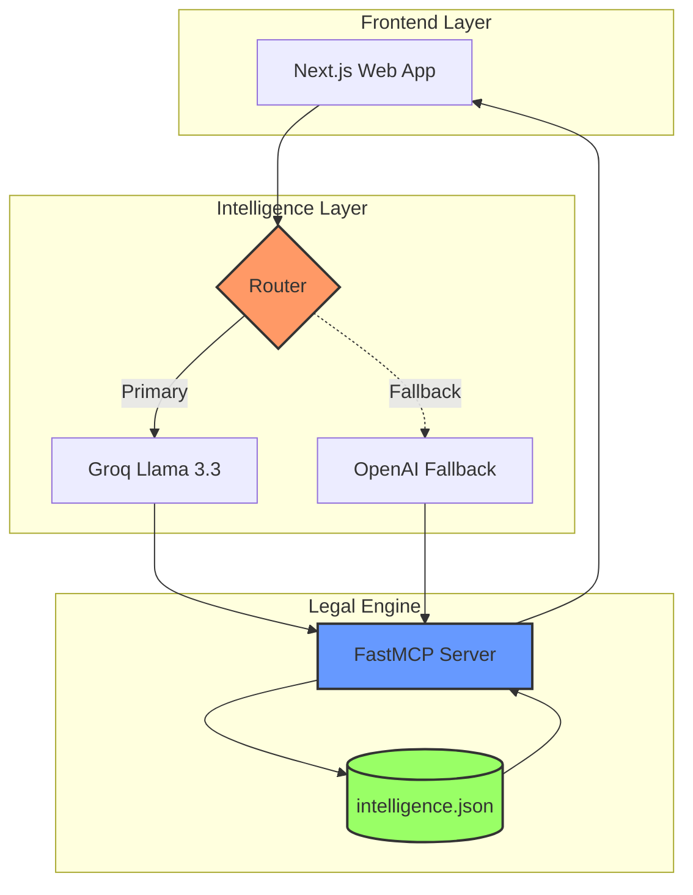

# Welcome to LawyerBot

## Project info

URL: https://legal-insight-engine-main.vercel.app

This project is built with:

- Vite
- TypeScript
- React
- shadcn-ui
- Tailwind CSS

This project is built with:

- Vite
- TypeScript
- React
- shadcn-ui
- Tailwind CSS
