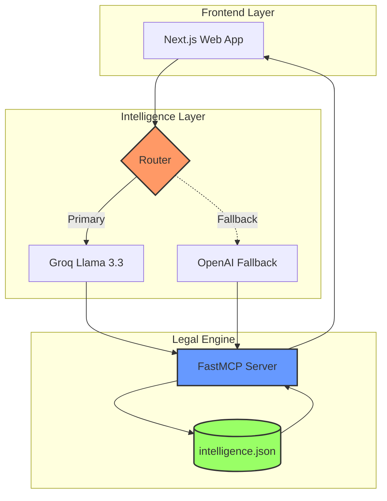

# Welcome to LawyerBot

## Project info

URL: https://legal-insight-engine-main.vercel.app

This project is built with:

- Vite
- TypeScript
- React
- shadcn-ui
- Tailwind CSS

### 📋 Requirements Traceability Matrix (RTM)

| ID | Category | Requirement | Technical Implementation | Status |
| :--- | :--- | :--- | :--- | :---: |
| **REQ-01** | **Core** | Rapid Legal Data Retrieval | `FastMCP Server` + `intelligence.json` | ✅ |
| **REQ-02** | **Logic** | High-Inference Reasoning | `Groq Llama-3.3` (LPU Inference) | ✅ |
| **REQ-03** | **Resilience** | API Failover Protection | `OpenAI GPT-5.3` Circuit Breaker | 🛡️ |
| **REQ-04** | **UX** | Real-time Observability | `System Health Monitor` Component | 📡 |
| **REQ-05** | **Business** | Token Cost Optimization | Context Pruning & Prompt Engineering | 💰 |
